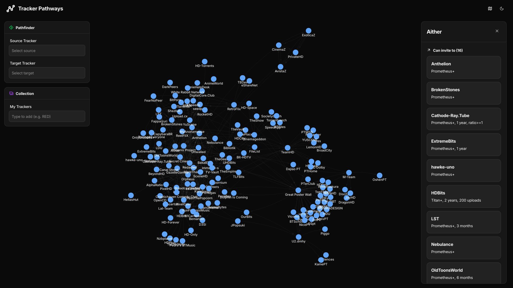

  
  <h1>Tracker Pathways</h1>

Discover the private tracker network.

  
  

Tracker Pathways is an open source tool designed to map the private tracker network, enabling exploration of invite routes with detailed requirements or visualization of connections using an interactive force directed graph to find the optimal path between communities.

## Contributing

You're very welcome to contribute to Tracker Pathways! Please follow the [contribution guide](CONTRIBUTING.md) to get started.

## Star History

<a href="https://www.star-history.com/#handokota/trackerpathways&type=date&legend=top-left">
 <picture>
   <source media="(prefers-color-scheme: dark)" srcset="https://api.star-history.com/svg?repos=handokota/trackerpathways&type=date&theme=dark&legend=top-left" />
   <source media="(prefers-color-scheme: light)" srcset="https://api.star-history.com/svg?repos=handokota/trackerpathways&type=date&legend=top-left" />
   
 </picture>
</a>

## License

This project is open source and available under the [MIT License](LICENSE).